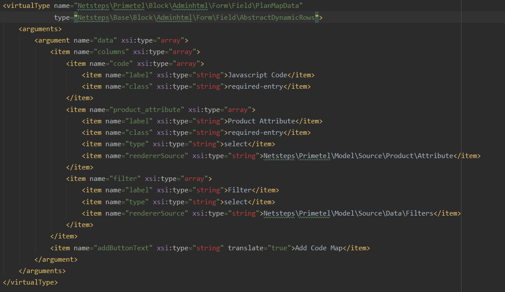

# Netsteps_Base

#### Abstract Classes Usages  

 
1. **Netsteps\Base\Block\Adminhtml\Form\Field\AbstractDynamicRows**  
  
   This class is used to created dynamic row field in system.xml without create a class file each time.  
   
   For example lets have a 3 field dynamic row field with fields Label, Icon Class, Count and the validations:  
   
   1. Javascript Code: required  
   2. Product Attribute: required - select input with source the model Netsteps\Primetel\Model\Source\Product\Attribute 
   3. Filter: select input with source the model Netsteps\Primetel\Model\Source\Data\Filters
         
   The usage would be to declare at our module a virtualType class that it would be an instance of AbstractDynamicRowsClass   
   The declaration for the above example would be declared in Vendor/Module/etc/di.xml file and it should be as follows:   
      
   

